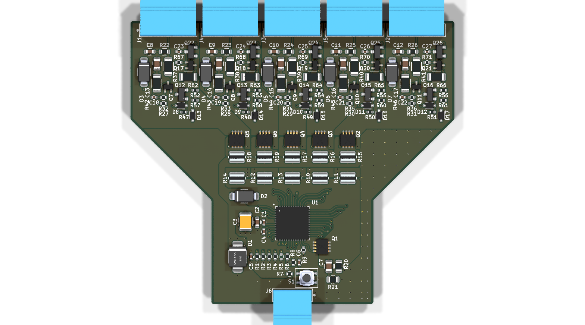
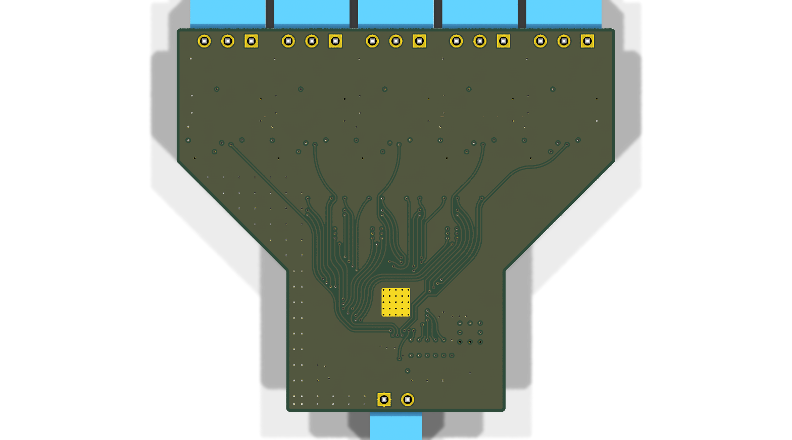

# Minimal_LTC4296-1

## Overview

This repository contains a minimal KiCad design project for the Analog Devices LTC4296-1, a 5-port SPoE (Single-Pair Power over Ethernet) PSE (Power Sourcing Equipment) controller. The project includes schematic designs and PCB layout files for implementing this versatile multi-port PoE controller.

## Disclaimer

> [!NOTE]
> This project is provided "as is" and without any warranty, express or implied. For more details, please see the [LICENSE](LICENSE) file.

## About the LTC4296-1

The LTC4296-1 from Analog Devices is a 5-port SPoE (Single-Pair Power over Ethernet) PSE controller designed for building and factory automation applications. It provides power sourcing equipment functionality for IEEE 802.3cg-compliant single-pair Ethernet systems.

Key features include:

- **5 Independent PSE Ports:** Controls up to five independent PSE ports with individual monitoring and control.
- **Wide Input Supply Range:** Operates from 6 V to 60 V, supporting both 24 V and 54 V systems.
- **IEEE 802.3cg Compliant:** Supports Single-Pair Power over Ethernet (SPoE) standard with power classes 10 through 15.
- **SCCP Support:** Supports Serial Communication Classification Protocol (SCCP) with external microcontroller for PD classification.
- **SPI Interface:** SPI bus interface with PEC (Packet Error Code) protection for digital control and monitoring.
- **Advanced Protection:** Features adjustable source and return electronic circuit breakers, high-side circuit breakers with foldback, and analog current limit (ACL).
- **Low Power Consumption:** Ultra-low input supply current of 52 μA (typ) in sleep state and 51 μA (typ) in disabled state.
- **Telemetry:** Voltage, current, and temperature telemetry with per-port power-good comparators.
- **Operating Temperature Range:** -40°C to +125°C.
- **Package:** Available in a 48-lead plastic QFN package (7 mm × 7 mm).

## Project Structure

```
minimal_ltc4296-1/
├── minimal_ltc4296-1.kicad_pro                     # Project configuration file
├── minimal_ltc4296-1.kicad_sch                     # Main schematic file
├── SCCP Circuit 0.kicad_sch                        # SCCP circuit schematic
├── minimal_ltc4296-1.kicad_pcb                     # PCB layout file
├── fp-lib-table                                    # Footprint library table
├── sym-lib-table                                   # Symbol library table
├── docs/                                           # Documentation files
│   ├── bom/                                        # Bill of Materials
│   │   └── minimal_ltc4296-1_ibom.html             # Interactive BOM file
│   ├── pictures/                                   # Images and photos
│   │   ├── 1_minimal_ltc4296-1_side.png            # Side view of PCB
│   │   ├── 2_minimal_ltc4296-1_top.png             # Top view of PCB
│   │   ├── 3_minimal_ltc4296-1_bottom.png          # Bottom view of PCB
│   │   ├── 4_minimal_ltc4296-1_left.png            # Left view of PCB
│   │   ├── 5_minimal_ltc4296-1_right.png           # Right view of PCB
│   │   ├── 6_minimal_ltc4296-1_front.png           # Front view of PCB
│   │   ├── 7_minimal_ltc4296-1_back.png            # Back view of PCB
│   │   └── 8_minimal_ltc4296-1_test.png            # Test view of PCB
│   └── schematics/                                 # Schematic PDF exports
│       └── minimal_ltc4296-1_schematics.pdf        # Complete schematics PDF
└── KiCAD_Symbols_Generator/                        # Submodule for symbol generation from CSV data
```

## Project Features

This design provides a minimal implementation of the LTC4296-1 with:

- 5-port PSE controller configuration
- SPI interface for digital control
- SCCP classification support
- Per-port current monitoring and protection
- Standard footprint for the 48-lead QFN package

## Getting Started

### Prerequisites

- [KiCad EDA](https://www.kicad.org/) version 9.0 or later installed on your system
- Git (for cloning the repository and submodule management)

### Opening the Project

1. **Clone the repository** (including submodules):
   ```bash
   git clone --recursive https://github.com/ionutms/Minimal_LTC4296-1.git
   ```

   If you've already cloned the repository without submodules, initialize them with:
   ```bash
   git submodule init
   git submodule update
   ```

2. **Open the project in KiCad**:
   - Launch KiCad
   - Click "Open Existing Project"
   - Navigate to the cloned repository folder
   - Select the `minimal_ltc4296-1.kicad_pro` file

3. **Explore the design**:
   - Open the schematic editor to view the circuit design
   - Open the PCB editor to view the board layout
   - Review the symbol and footprint libraries used in the design

### Project Files

- **Main schematic**: `minimal_ltc4296-1.kicad_sch` - Contains the primary circuit design with the LTC4296-1 and support components
- **SCCP schematic**: `SCCP Circuit 0.kicad_sch` - SCCP circuit implementation for PD classification
- **PCB layout**: `minimal_ltc4296-1.kicad_pcb` - Physical board design file with proper component placement
- **Project configuration**: `minimal_ltc4296-1.kicad_pro` - KiCad project settings

## Dependencies

This project has the following dependencies:

### 1. KiCAD Symbols Generator

This repository uses [KiCAD_Symbols_Generator](https://github.com/ionutms/KiCAD_Symbols_Generator) as a submodule for custom symbol generation.

To initialize the submodule after cloning this repository:

```bash
git submodule update --init --recursive
```

### 2. 3D Models

This project requires the [3D_Models_Vault](https://github.com/ionutms/3D_Models_Vault) repository for 3D models.

#### Setup for KiCAD 9:

1. Clone the 3D models repository:
   ```bash
   git clone https://github.com/ionutms/3D_Models_Vault.git
   ```

2. In KiCAD 9, add an environment variable:
   - Variable name: `KICAD9_3D_MODELS_VAULT`
   - Variable value: Full path to where you cloned the 3D_Models_Vault repository

## Usage

After setting up the dependencies, open the project in KiCad 9 to access all features including the 3D models.

## Symbol Generator Submodule

This project includes the KiCAD_Symbols_Generator as a submodule, which provides tools for generating KiCad symbols from CSV data files. For more information on using this tool, see the [KiCAD_Symbols_Generator documentation](minimal_ltc4296-1/KiCAD_Symbols_Generator/README.md).

## Documentation

The `docs` folder contains:
- Schematic PDF exports
- Images and photos of the design

## Visuals

The following images showcase the PCB design from different perspectives:


*Top View of the PCB*


*Side View of the PCB*


*Bottom View of the PCB*

## License

This project is licensed under the MIT License - see the [LICENSE](LICENSE) file for details.

## References

- [LTC4296-1 Datasheet](https://www.analog.com/media/en/technical-documentation/data-sheets/ltc4296-1.pdf)
- [LTC4296-1 Product Page](https://www.analog.com/en/products/ltc4296-1.html)
- [KiCad EDA](https://www.kicad.org/)
